# Codex Skins

A collection of desktop skins for Codex, with launchers that inject the selected skin through Chrome DevTools Protocol (CDP).

## Requirements

- Windows with the Codex desktop application installed. The launcher prefers the Microsoft Store package (`OpenAI.Codex`).
- Windows PowerShell 5.1 or later.
- The Windows launcher supports both Codex.exe and ChatGPT.exe desktop process names.
- macOS with Codex installed at `/Applications/Codex.app`. The macOS launcher uses Codex's bundled Node runtime, so Homebrew or a global Node.js install is not required.

Both platform launchers use the Node runtime bundled inside the Codex desktop application. Windows resolves `resources\cua_node\bin\node.exe`; macOS resolves `Contents/Resources/cua_node/bin/node`. The shared `runtime/apply-skin.cjs` handles the platform-neutral CDP payload evaluation, while the `.ps1` and `.sh` files keep platform-specific launch and restart behavior. No system Node.js installation is required.

## Platform Limitation

On Windows, the Codex toolbar and other native controls may retain system-controlled colors, so a skin cannot guarantee perfectly unified colors across every toolbar element. macOS does not have this limitation.

## One-Sentence Codex Setup (Windows/macOS)

Send this single sentence to Codex from either Windows or macOS. Replace `purple-gunner` with any skin ID from the table below:

```text
Install or update https://github.com/SleepyQiao/codex-skins, choose the launcher for this operating system, apply the `purple-gunner` skin, preserve all Codex features and the normal upgrade mechanism, keep only one successfully injected desktop instance, and report the result.
```

## Use A Skin On Windows

1. Save any work in Codex. The launcher starts one isolated CDP-enabled profile, then gracefully closes older visible windows and exits matching older desktop background processes; it never uses forced termination.
2. Open PowerShell and run the launcher with a skin directory.

```powershell
cd E:\codex-skins
powershell.exe -NoProfile -ExecutionPolicy Bypass -File .\apply-windows-skin.ps1 .\skins\purple-gunner
# Or pass the skin ID directly:
powershell.exe -NoProfile -ExecutionPolicy Bypass -File .\apply-windows-skin.ps1 purple-gunner
```

Replace `purple-gunner` with any skin ID from the table below. The launcher reuses an existing CDP page on `9222` or `9223`; when it must start a new instance, the default startup port is `9223`. Use `-Port` or `-Timeout` when needed.

On Windows, the launcher first reuses an existing CDP page. If none exists, it starts exactly one isolated temporary profile on `9223`, waits for CDP, then gracefully closes older visible Codex/ChatGPT windows. Repeated runs reuse the existing CDP page instead of creating another tray instance. Your normal Codex data directory is not replaced.

```powershell
powershell.exe -NoProfile -ExecutionPolicy Bypass -File .\apply-windows-skin.ps1 .\skins\cyber-neon -Port 9223 -Timeout 30
```

Successful execution prints the applied skin name. To verify the launcher files and package-path validation without starting Codex:

```powershell
powershell.exe -NoProfile -ExecutionPolicy Bypass -File .\test\apply-windows-skin.tests.ps1
```


## Use A Skin On macOS

To run the macOS launcher manually, use this one-line installer and change `SKIN=flame-zhaoxin` to any skin ID below:

```bash
SKIN=flame-zhaoxin bash -lc 'ROOT="$HOME/Library/Application Support"; REPO="$ROOT/codex-skins"; mkdir -p "$ROOT"; if [ -d "$REPO/.git" ]; then git -C "$REPO" pull --ff-only; else git clone https://github.com/SleepyQiao/codex-skins.git "$REPO"; fi; if [ ! -L "$ROOT/skins" ]; then [ -e "$ROOT/skins" ] && mv "$ROOT/skins" "$ROOT/skins.backup-$(date +%Y%m%d-%H%M%S)"; fi; ln -sfn "$REPO/skins" "$ROOT/skins"; cd "$REPO" && ./apply-mac-skin.sh "$SKIN"'
```

Already cloned?

```bash
./apply-mac-skin.sh flame-zhaoxin
```

If Codex is already running with CDP enabled on the selected port, the launcher reuses that session. Otherwise it quits Codex normally and reopens it with `--remote-debugging-port`.

Use `--port` or `--timeout` when needed:

```bash
./apply-mac-skin.sh flame-zhaoxin --port 9222 --timeout 30
```

Run the launcher as your normal user, not with `sudo`. If an older stuck launcher left a stale lock, stop that old `apply-mac-skin.sh` process and run the command again.

## Safety And Upgrades

The launcher injects the selected skin only into Codex's running renderer through its local CDP session. It does not modify the Codex application bundle, replace Codex features, or alter its update mechanism. Quit or restart Codex normally to return to its unskinned state; install Codex updates normally, then run the launcher again when you want to apply a skin.
## Available Skins

| ID | Skin | Description |
| --- | --- | --- |
| `flame-zhaoxin` | Flame Zhao Xin | Crimson battlefield |
| `lanting-ink-yasuo` | Lanting Ink Yasuo | Ink-wash sword intent |
| `lanting-ink-tuer-suo` | Lanting Ink Tuer Suo | Rice-paper sword intent |
| `midnight-aurora` | Midnight Aurora | Aurora gradient |
| `dragon-liqing` | Dragon Lee Sin | Golden dragon ink shadow |
| `purple-gunner` | Purple Gunner | Amethyst soft glow |
| `sakura-dawn` | Sakura Dawn | Soft pink gradient |
| `amber-dusk` | Amber Dusk | Warm gold gradient |
| `forest-mist` | Forest Mist | Forest gradient |
| `cyber-neon` | Cyber Neon | Neon gradient |
| `romantic-rose` | Romantic Rose | Portrait soft glow |
| `twilight-palm` | Twilight Palm | Tropical sunset with palm silhouettes |

## Skin Gallery

Click a thumbnail to preview the skin background at full size.

| | | |
| --- | --- | --- |
| <a href="skins/flame-zhaoxin/thumb.jpg">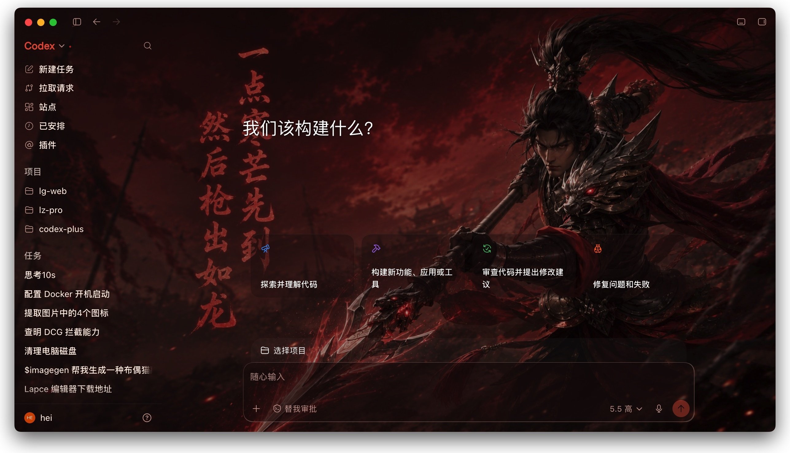</a> | <a href="skins/lanting-ink-yasuo/thumb.jpg">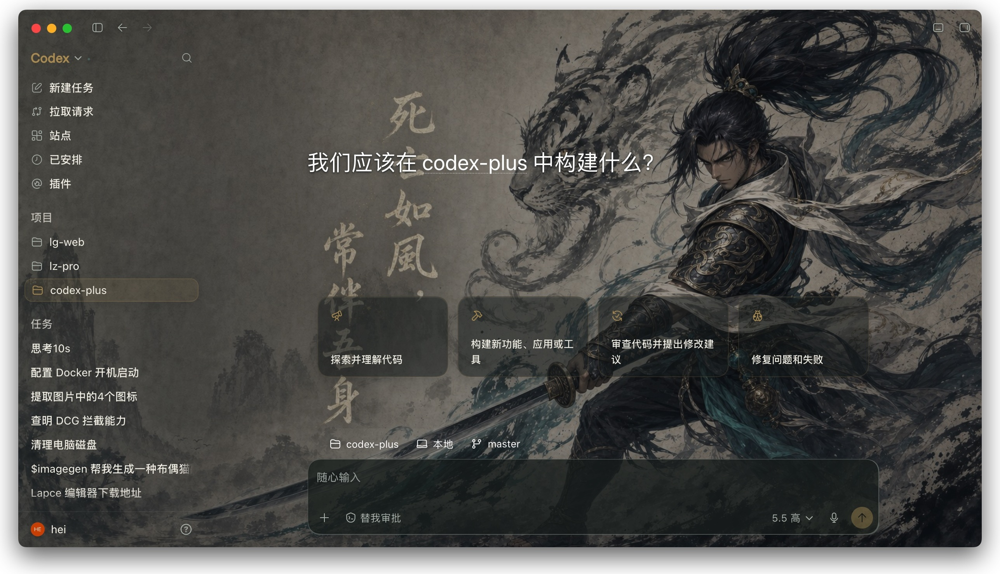</a> | <a href="skins/lanting-ink-tuer-suo/thumb.jpg">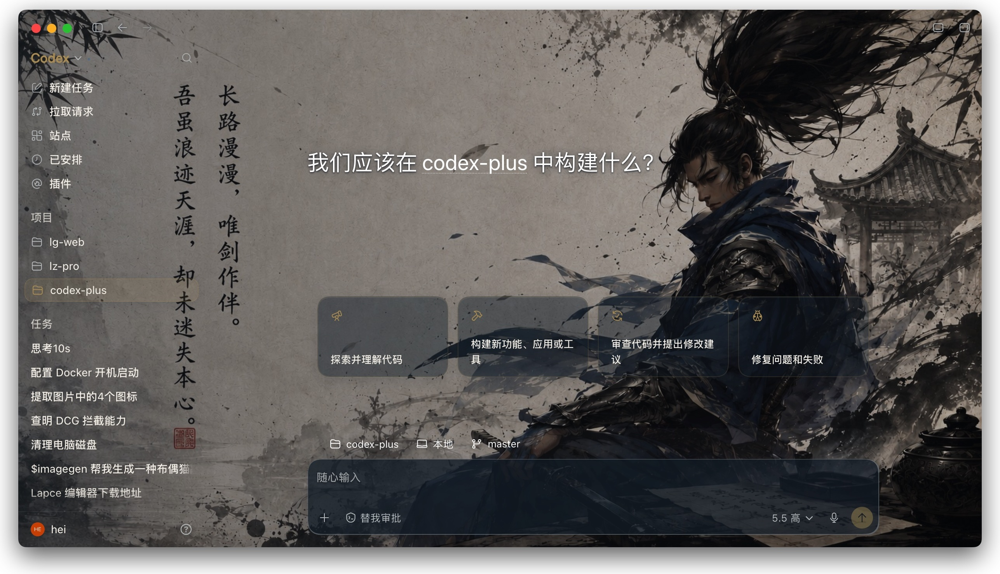</a> |
| `flame-zhaoxin` | `lanting-ink-yasuo` | `lanting-ink-tuer-suo` |
| <a href="skins/midnight-aurora/thumb.jpg">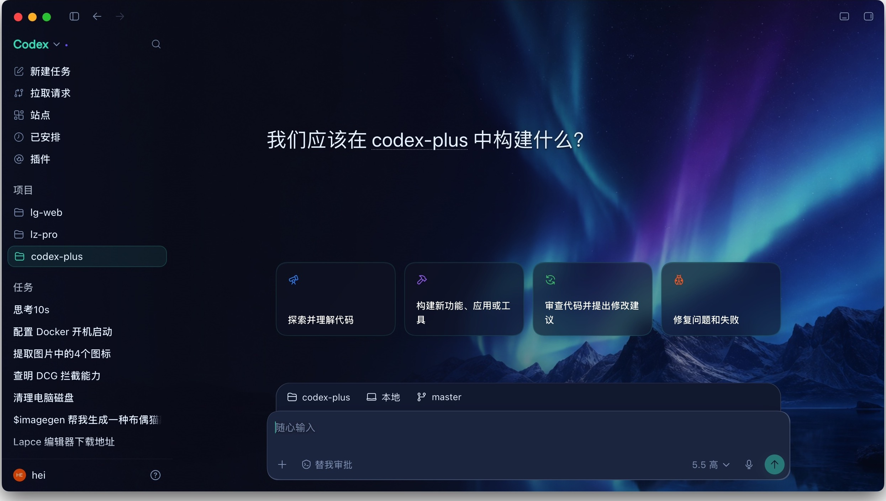</a> | <a href="skins/dragon-liqing/thumb.jpg">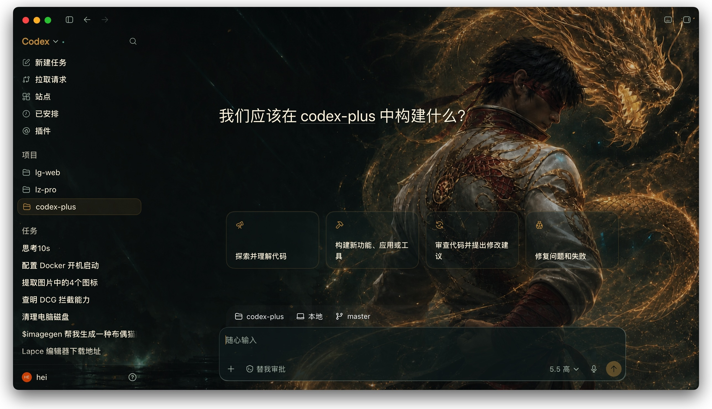</a> | <a href="skins/purple-gunner/thumb.jpg">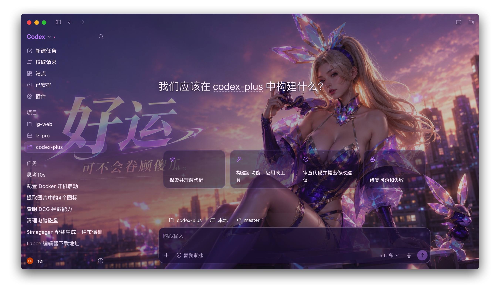</a> |
| `midnight-aurora` | `dragon-liqing` | `purple-gunner` |
| <a href="skins/sakura-dawn/thumb.jpg">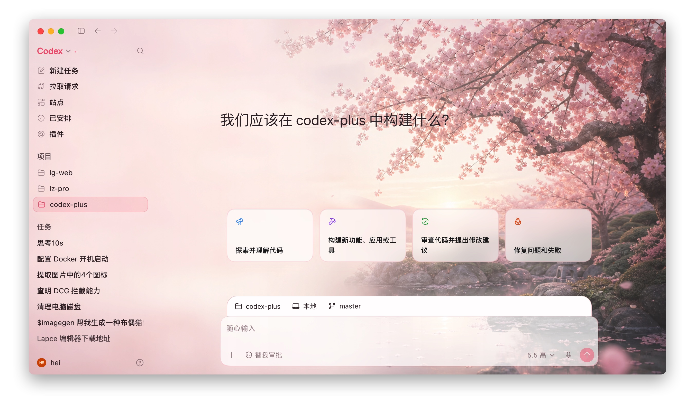</a> | <a href="skins/amber-dusk/thumb.jpg">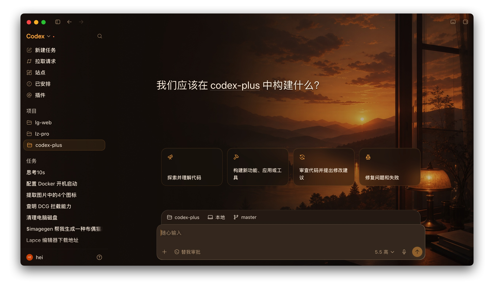</a> | <a href="skins/forest-mist/thumb.jpg">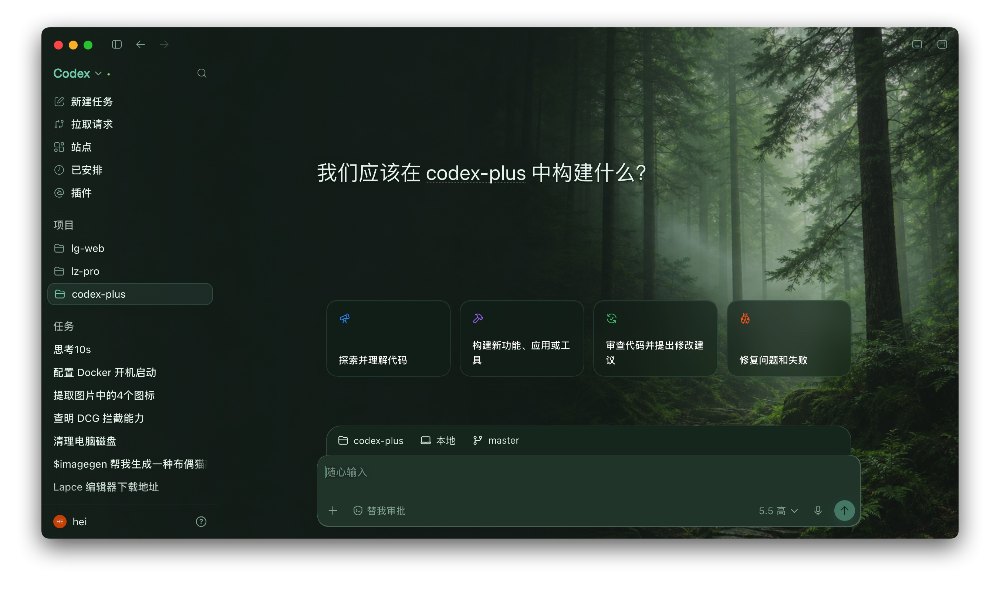</a> |
| `sakura-dawn` | `amber-dusk` | `forest-mist` |
| <a href="skins/cyber-neon/thumb.jpg">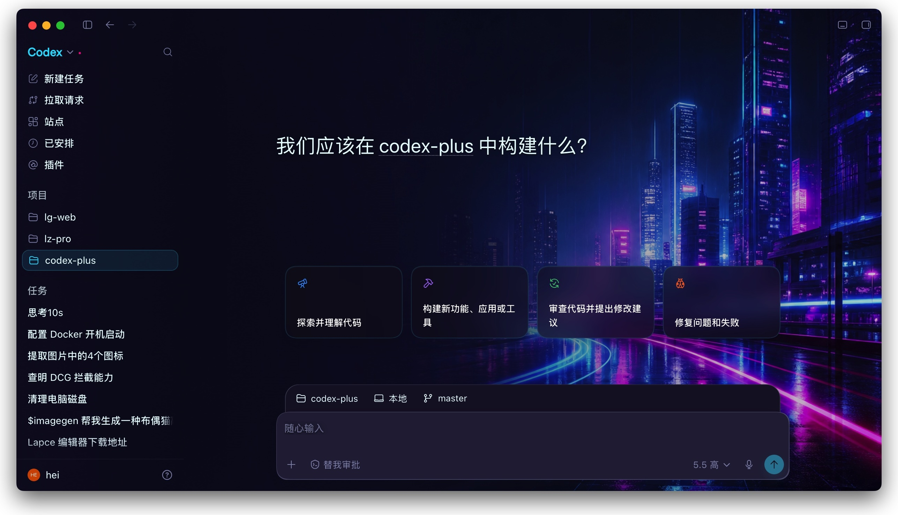</a> | <a href="skins/romantic-rose/thumb.jpg">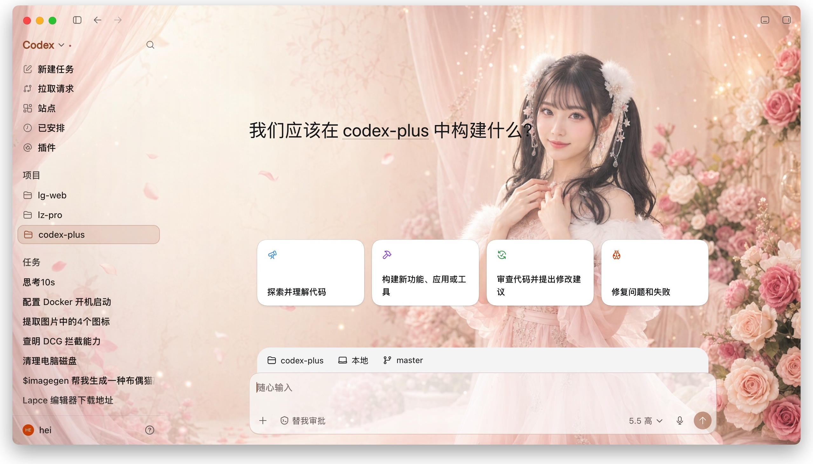</a> | <a href="skins/twilight-palm/thumb.jpg">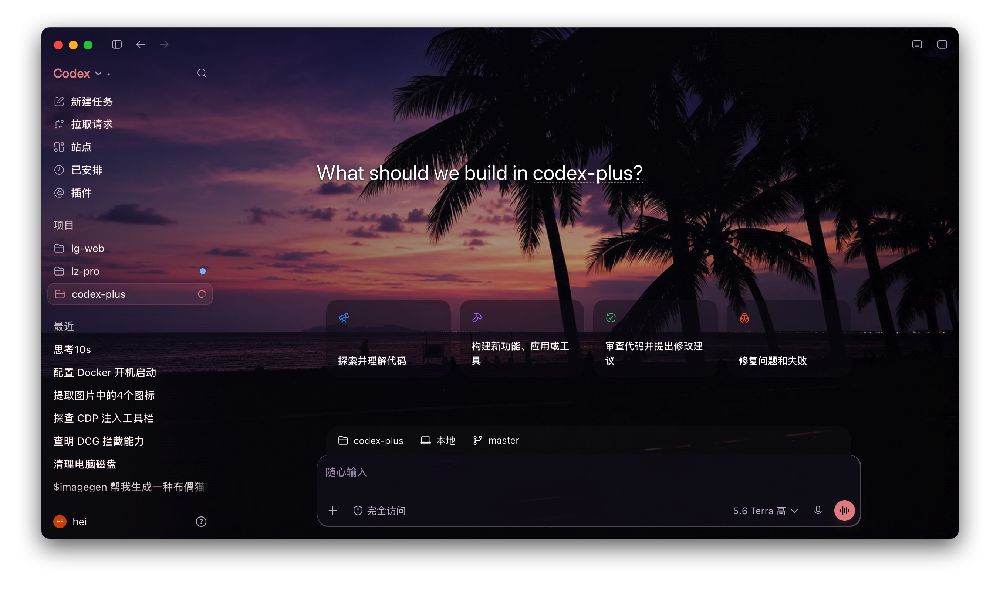</a> |
| `cyber-neon` | `romantic-rose` | `twilight-palm` |

## Repository Layout

```text
codex-skins/
|-- apply-windows-skin.ps1     # Windows launcher
|-- apply-mac-skin.sh          # macOS Node launcher entrypoint
|-- runtime/
|   |-- apply-skin.cjs         # Shared Windows/macOS CDP runtime
|   |-- renderer-inject.js     # CDP page injection payload
|   `-- dream-skin.css         # Shared skin styles
|-- skins/
|   `-- <skin-id>/
|       |-- skin.json          # Package metadata and asset paths
|       |-- theme.json         # Theme ID, appearance, and palette
|       |-- style.css          # Optional skin-specific CSS
|       |-- background.jpg     # Background used by the launcher
|       `-- thumb.jpg          # Preview image
`-- test/
    |-- apply-windows-skin.tests.ps1
    `-- apply-mac-skin.tests.sh
```

## Skin Package Format

Each skin must be contained in its own `skins/<skin-id>/` directory. `skin.json` requires `schemaVersion: 1`, `kind: "dream"`, a non-empty `id` and `name`, a `swatchColor` in `#RRGGBB` format, and package-relative `background` and `theme` paths. `style` is optional.

```json
{
  "schemaVersion": 1,
  "id": "my-skin",
  "name": "My Skin",
  "kind": "dream",
  "swatchColor": "#7c3aed",
  "background": "background.jpg",
  "theme": "theme.json",
  "style": "style.css"
}
```

Do not use absolute paths or `..` path segments in package assets. The launcher rejects assets outside the selected skin directory.
